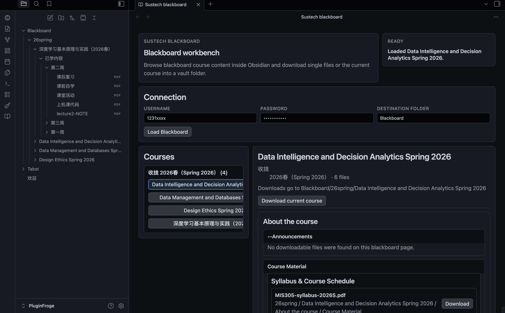

# SUSTech Blackboard

## 一键下载南科大bb系统课程附件

本插件受 https://github.com/naivecynics/SVSmate 启发和技术支持，根据 Obsidian 的特点进行了一些微调和适配。



批量下载：一键查看当前学期所有课程资料并一次性下载。

只写：我们不做同步，去重，断点续传等复杂逻辑。就按照给定的目录直接下载。请不要在默认或者你自定义的下载目录下覆盖或者编辑，可能导致你的修改被覆盖造成损失。

不保存你的密码：考虑到一次性批量下载的频率较低，以及Obsidian还是没有比较好的官方密码存储的方法，我们将认证学号和密码的填写直接摆在workbench的界面，防止把密码明文存储到本地。

侧边栏按钮呼出： 书本的小 icon，点击打开管理界面

命令行呼出：`ctrl+p(win)/cmd+p(macos)` 然后键入 sus 选择 `SUSTech-Blackboard Open Workbench` 即可打开 管理界面

## 作者的话

一直很苦于下载和同步blackboard平台上面的各种附件，直到我遇到了 SVSmate，查看各类附件变得非常简单。感谢他们的工作！不过我之后发现vscode的管理方式有些麻烦，因为vscode的按键和各类入口实在是太多了，有时候全局安装SVSmate也有些不明不白的Notice打扰，或者手滑需要重新认证。最大的痛点则是我没找到一键下载所有附件的简单入口，每次都要点开复杂的层级下载然后决定把文件下载到哪里哪里。

所以这个Obsidian插件的思路很简单，就是一键下载，然后你可以在本地想怎么管理怎么管理自己的附件。

对于只读附件，比如一般的pdf文件，可以在Obsidian中直接通过 `[[filename.pdf]]` 引用和查看。即使再次下载覆盖也不会有太大影响。

对于你要编辑的作业等，建议下载后自行找额外的目录存放进行管理。

目标下载目录只有一个目的：（支持批量）下载bb系统上的附件。


## Phase 1 scope

The current plugin supports:

- loading Blackboard terms and courses from SUSTech CAS login
- viewing the current course content tree inside the ItemView
- downloading a single file on demand
- downloading the current course into a vault-relative destination folder while preserving the Blackboard directory hierarchy

## Interface

All Blackboard operations stay inside the current `ItemView`:

- username input
- password input for the current session only
- destination folder input
- course list browser
- single-file download buttons
- **Download current course** action

## Notes

- The plugin is desktop-only.
- Network requests are sent only to SUSTech CAS and Blackboard.
- Downloaded files are written inside the current vault.

## Development

```bash
npm install
npm test
npm run build
```
